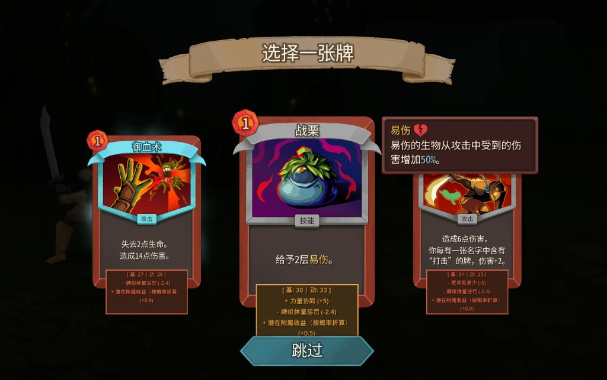
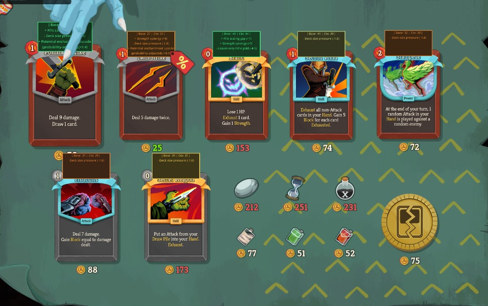

# STS2 Context Coach

Context-aware card recommendation overlay for Slay the Spire 2 reward/shop choices.

For most players, this mod is **plug-and-play**: download a release zip, extract into your game `mods` folder, and play. You do **not** need Python, wiki fetch, or LLM setup to use it.

## Preview

Add screenshots under `docs/images/` in this repo, then keep these links as-is:




## Requirements

- **BaseLib is required.** This mod depends on BaseLib to load and patch into STS2.
- Slay the Spire 2 with mod loading enabled (beta branch/mod-capable branch).

## Installation (Typical User)

1. Download `Sts2ContextCoach-vX.Y.Z.zip` from GitHub Releases.
2. Extract the zip contents into:
   - `<Slay the Spire 2>/mods/Sts2ContextCoach/`
3. Confirm these files exist:
   - `Sts2ContextCoach.dll`
   - `Sts2ContextCoach.json`
   - `result_cleaned.csv`
   - `data/cards.json`
   - `data/relics.json`
4. Ensure [BaseLib](https://github.com/Alchyr/BaseLib-StS2) is installed/enabled.
5. Launch game.

## What It Shows

- `Base` + `Ctx` score on reward/shop cards.
- Top context reasons with explicit signed impact (`+` / `-`).
- Mixed positives/negatives so tradeoffs are visible.

## Supported Features

- **Deck context:** draw/block/frontload/scaling pressure, curve pressure, redundancy.
- **Shop context:** affordability, tight-gold penalties, sale/value bonuses.
- **Upgrade context:** deterministic mechanics from wiki text + upgrade value tiers.
- **Enchantment context:** realized value if present + modest expected-value upside.
- **Localization:** embedded English + Simplified Chinese (`zhs` auto-maps to `zh-CN`).

## Example Usage

- **Reward pick:** compare `Ctx` and reason lines to see whether a card solves your current deck gap (draw, block, scaling, etc.).
- **Shop pick:** check affordability penalties before buying high-score cards when gold is tight.
- **Enchanted cards:** if a card already has an enchantment, realized-value context can materially change priority.
- **Upgrades:** cards with strong upgrade trajectories can get extra context value even when base form is average.

## FAQ

### Why don’t I see any overlay?

- Verify BaseLib is installed and loaded.
- Check folder nesting; avoid `mods/Sts2ContextCoach/Sts2ContextCoach/...`.
- Confirm `Sts2ContextCoach.dll` and `Sts2ContextCoach.json` are in the same mod folder.

### Why is Chinese not showing?

- The mod auto-detects STS2 language and maps `zhs` to `zh-CN`.
- You can force language via `STS2_CONTEXT_COACH_LANG=zh-CN`.

### Is LLM required to play with this mod?

- No. LLM tooling is only for maintainers refreshing metadata.
- End users only need the release zip files.

### Can I tune logging?

- `STS2_CONTEXT_COACH_VERBOSE=1` enables verbose diagnostics.
- Default usage should keep logs quieter.

## Credits / Inspiration

- This project builds on its own context-scoring pipeline and metadata flow.
- Initial static-value direction was inspired by the STS2 draw-rate mod: [blackpatton17/sts2-draw-rate](https://github.com/blackpatton17/sts2-draw-rate).

## Maintainer Notes (Optional)

### Data Refresh / LLM

This workflow is maintainer-only and not needed for normal gameplay users.

- See `tools/data_refresh/README.md`.
- Keep API keys in environment variables only.
- Do not commit `tools/data_refresh/config.yaml` (gitignored).

### Build / Package

```powershell
dotnet build .\Sts2ContextCoach.csproj -c Release
powershell -ExecutionPolicy Bypass -File .\tools\release\build-release.ps1
```

Release zip output is written to `release/`.

